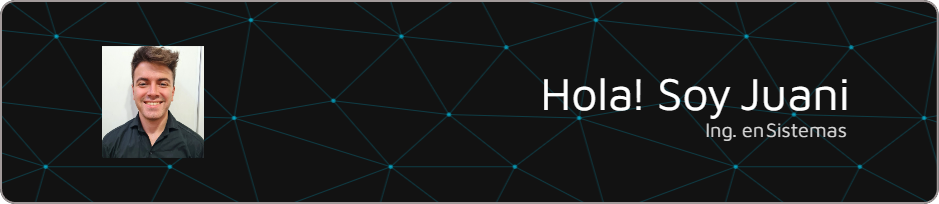

#  Bienvenido a mi GitHub

## Tecnologias 💻

 

 

 

#### 📚 Projects Highlighted During My Bachelor's Degree  
> Some of the most relevant academic projects I worked on during my studies.

- 🏢 **IT Project Management for a Multinational Company**  
  Collaborated with my team to analyze and implement IS&IT solutions for an organization. Tasks included requirement analysis, risk assessment, contingency planning, and project documentation (Project Charter, WBS, RFI, Gantt Chart, procurement contracts, etc.).

- 👪 **Simulation of People Flow Control Systems**  
  Developed a simulation to study congestion in enclosed spaces. Proposed structural solutions to optimize the movement and evacuation of people, improving both speed and safety.

- 🖨️ **3D Additive Manufacturing**  
  Conducted research on job profiles and safety measures in additive manufacturing. Additionally, printed various objects such as anatomical models for medical research, botany-related items, and practical tools like phone holders and toys.

---

#### 🖥️ Software Development Projects  
> A selection of my most relevant software projects.

- 📈 **M/M/1 Simulation System**  
  Implemented a queueing system simulation in **Python**, with **3D visualization in AnyLogic**.  
  🔗 [View project](https://github.com/Luchoragusa/Simulacion/tree/main/TP-3/MM1)

- 📋 **University Course Registration System**  
  Developed in **Visual Studio C++**, this system handles student enrollment with constraints on quotas, schedules, teachers, and commissions.  
  🔗 [View project](https://github.com/Luchoragusa/TP-Final-.NET)

- 🖱️ **UCP GTA in Java**  
  Created a **Dynamic Web Project** in **Eclipse IDE** using **JSP**, inspired by the UCP GTA system from Grand Theft Auto.  
  🔗 [View project](https://github.com/Luchoragusa/UCP)

- 🛒 **Video Game Store (Steam-like App)**  
  Full-stack application developed using **Node.js, Angular, and MySQL**, designed to function as a digital video game marketplace.  
  🔗 [View project](https://github.com/Luchoragusa/MachineStore-Front)

- 📝 **My Personal Portfolio**  
  A showcase of my experience, education, projects, and skills, built as my **personal website**.  
  🔗 [Visit my portfolio](https://jipucheta.netlify.app/)

---

#### 📖 What I'm Currently Learning & Doing  
> Expanding my knowledge and working on exciting projects.

- 🚀 **Deepening my front-end development skills**, exploring modern frameworks and best practices.  
- 🇩🇪 **Learning German** at the UTN FRRo Language Center and through self-study.  
- 📊 **Analyzing, documenting, planning, and prototyping real-world projects**, including a hardware store and an agricultural laboratory.  
- 📌 **Mastering agile methodologies** to improve teamwork, efficiency, and project execution.  
